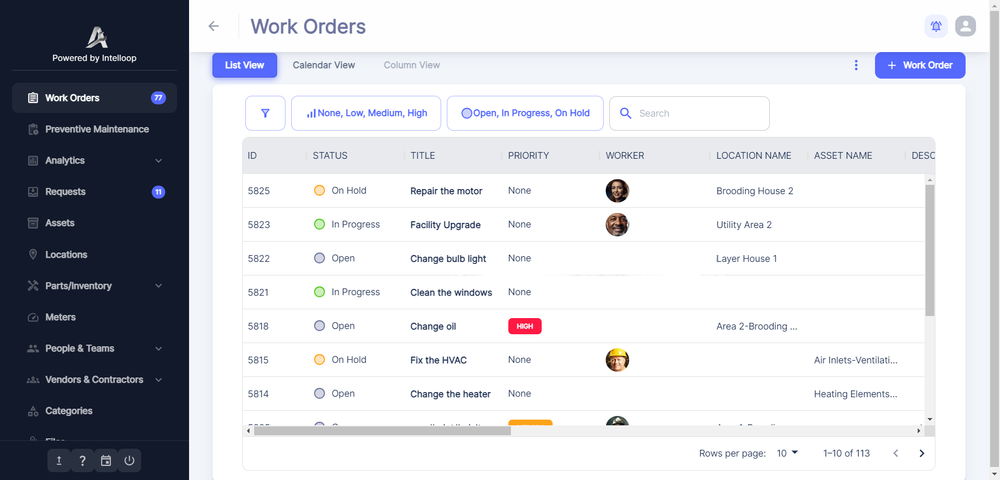

<p align="center"></p>
<h1 align="center">Atlas CMMS</h1>

[Atlas CMMS](https://github.com/grashjs/cmms) is a powerful, self-hosted maintenance management system designed for both
web and mobile platforms using Docker. It simplifies and automates the management of maintenance activities, making it
ideal for IT managers or developers looking to implement solutions that keep their organization's assets running
smoothly.
Think of it like **Jira for technicians**.

**Example industries**

- Facilities Managers (buildings, property, real estate)
- Manufacturing/Production Teams (machinery and equipment)
- Healthcare Facilities (medical equipment maintenance)
- Hospitality Managers (hotels and resorts)
- Public Sector (infrastructure and public buildings)
- Educational Institutions (campus maintenance)
- Utility Companies (power, water, and energy systems)

**Demo website**

- https://atlas-cmms.com

**Screenshots**:
<div align="center">




</div>

## ⚡ **Features**

### Work Orders & Maintenance

- 📝 Create, assign, and track work orders.
- ⏱️ Log time, set priorities, and track history.
- 🤖 Automate work orders with triggers.
- 📊 Export reports and view analytics.

### Analytics & Reporting

- 💼 Work order compliance and cost analysis.
- 🛠️ Equipment downtime and reliability insights.
- 💵 Cost trends and labor tracking.

### Equipment & Inventory

- ⚙️ Track equipment, downtime, and maintenance costs.
- 📦 Manage inventory with stock alerts.
- 🛒 Automate purchase orders and approvals.

### User & Workflow Management

- 👥 Assign tasks to teams or service providers.
- 🧑‍💼 Customizable user roles and permissions.
- 🔄 Define workflows with automation logic.

### Locations & Requests

- 📍 Manage locations with Google Maps integration.
- 📑 Create and track service requests.

You can check out the [complete list of features](api/Current%20features.pdf).

We'd love to have **new contributors**, so feel free to join us!  
⭐ **Star this repo to support us!**

## Self Host / Run locally

### Set environment variables

Download this file [.env.example](.env.example), rename it to `.env` and configure the environment variables inside it.
Do not delete the .env file

| Name                        | Required | Description                                                                                                                                                                                                                                                                                                 | Default Value         |
|-----------------------------|----------|-------------------------------------------------------------------------------------------------------------------------------------------------------------------------------------------------------------------------------------------------------------------------------------------------------------|-----------------------|
| POSTGRES_USER               | Yes      | Postgres user                                                                                                                                                                                                                                                                                               | rootUser              |
| POSTGRES_PWD                | Yes      | Postgres password                                                                                                                                                                                                                                                                                           | mypassword            |
| MINIO_USER                  | Yes      | MiniO user                                                                                                                                                                                                                                                                                                  | minio                 |
| MINIO_PWD                   | Yes      | MiniO password                                                                                                                                                                                                                                                                                              | minio123              |
| ENABLE_EMAIL_NOTIFICATIONS  | No       | Enables or disables email notifications (`true` or `false`). Requires SMTP if enabled.                                                                                                                                                                                                                      | false                 |
| INVITATION_VIA_EMAIL        | No       | Enables or disables user invitations via email (`true` or `false`). Requires SMTP and ENABLE_EMAIL_NOTIFICATIONS if enabled.                                                                                                                                                                                | false                 |
| SMTP_HOST                   | No       | The SMTP host                                                                                                                                                                                                                                                                                               | smtp.gmail.com        |
| SMTP_PORT                   | No       | The SMTP port                                                                                                                                                                                                                                                                                               | 587                   |
| SMTP_USER                   | No       | The SMTP username. If using Gmail, [Learn how to create an app password](https://support.google.com/accounts/answer/185833?hl=en)                                                                                                                                                                           | (empty)               |
| SMTP_PWD                    | No       | The SMTP password. If using Gmail, [Learn how to create an app password](https://support.google.com/accounts/answer/185833?hl=en)                                                                                                                                                                           | (empty)               |
| JWT_SECRET_KEY              | No       | JWT secret key                                                                                                                                                                                                                                                                                              | your_jwt_secret       |
| ALLOWED_ORGANIZATION_ADMINS | No       | Comma separated email addresses allowed to sign up without being invited, hence allowed to create organizations. Empty means everyone can create an organization                                                                                                                                            | (empty)               |
| GOOGLE_KEY                  | No       | Google Maps API key                                                                                                                                                                                                                                                                                         | (empty)               |
| GOOGLE_TRACKING_ID          | No       | Google Analytics tracking ID                                                                                                                                                                                                                                                                                | (empty)               |
| PUBLIC_FRONT_URL            | No       | Frontend URL in this format `http://your.public.ip:3000` . Multiple addresses may open the website but only this one will work with the backend because of CORS.                                                                                                                                            | http://localhost:3000 |
| PUBLIC_API_URL              | No       | Public API URL in this format `http://your.public.ip:8080`                                                                                                                                                                                                                                                  | http://localhost:8080 |
| STORAGE_TYPE                | No       | Type of storage either local MinIO or Google Cloud Storage `gcp` or `minio`                                                                                                                                                                                                                                 | minio                 |
| PUBLIC_MINIO_ENDPOINT       | No       | Public Mini endpoint in format `http://public.ip:9000`                                                                                                                                                                                                                                                      | http://localhost:9000 |
| GCP_JSON                    | No       | The Google Cloud JSON key after following [these instructions](./GCP-setup.md).                                                                                                                                                                                                                             | (empty)               |
| GCP_PROJECT_ID              | No       | The Google Cloud project ID, also found in the `GCP_JSON` file.                                                                                                                                                                                                                                             | (empty)               |
| GCP_BUCKET_NAME             | No       | GCP Bucket Name                                                                                                                                                                                                                                                                                             | (empty)               |
| MAIL_RECIPIENTS             | No       | Comma-separated email addresses of the super admins where to send information emails like new signups. You can provide your email address.                                                                                                                                                                  | (empty)               |
| LICENSE_KEY                 | No       | Atlas CMMS license key to get access to advanced features like SSO.                                                                                                                                                                                                                                         | (empty)               |
| MUI_X_LICENSE               | No       | [Mui Pro](https://mui.com/store/items/mui-x-pro) license key. 1 dev and 1 year license is perpetual in production                                                                                                                                                                                           | (empty)               |
| ENABLE_SSO                  | No       | Enables or disables SSO. (`true` or `false` ) Requires `OAUTH2_PROVIDER`, `OAUTH2_CLIENT_ID` and `OAUTH2_CLIENT_SECRET`. Make sure to add `PUBLIC_FRONT_URL` as authorized origin and `${PUBLIC_API_URL}/oauth2/callback/${OAUTH2_PROVIDER}` as authorized redirection URI in your Oauth2 provider settings | false                 |
| OAUTH2_PROVIDER             | No       | Oauth2 provider `google` or `microsoft`                                                                                                                                                                                                                                                                     | (empty)               |
| OAUTH2_CLIENT_ID            | No       | Oauth2 Client ID                                                                                                                                                                                                                                                                                            | (empty)               |
| OAUTH2_CLIENT_SECRET        | No       | Oauth2 client secret                                                                                                                                                                                                                                                                                        | (empty)               |
| LOGO_PATHS                  | No       | Logo names in this format. `{"dark": "dark.png","white": "white.png", }`. Add 2 logos in a folder named `logo` in the same folder as the `docker-compose.yml`.  Needs a license.                                                                                                                            | (empty)               |
| CUSTOM_COLORS               | No       | Custom colors in JSON format. All colors should be in hexadecimal format. `{"emailColors":"#00A0E3","primary":"#EE4B2B","secondary":"#6E759F","success":"#57CA22","warning":"#FFA319","error":"#FF1943","info":"#33C2FF","black":"#223354","white":"#ffffff","primaryAlt":"#000C57"}`                       | (empty)               |
| BRAND_CONFIG                | No       | Brand config for white labeling. Requires license. In format `{ "name": "Quantum Labs", "shortName": "QL", "website": "https://example.io", mail: "contact@example.io" }`                                                                                                                                   | (empty)               |

For production deployments, it’s strongly recommended to use unique credentials and not rely on defaults.

#### For remote servers

- You need to update every env variable starting with `PUBLIC_`.

- Open ports if necessary: make sure to open `PUBLIC_API_URL`, `PUBLIC_FRONT_URL` ports numbers by default
  8080, and 3000. Same for `PUBLIC_MINIO_ENDPOINT` port 9000 if you use Minio.
- Make sure the backend and frontend use the same protocol: https or http

### Run

Download this [docker-compose.yml file](./docker-compose.yml). At this point you should have 2 files `.env` and
`docker-compose.yml`.
Now run

```sh
docker-compose up -d
```

Go to http://localhost:3000 or your custom `PUBLIC_FRONT_URL`

Celebrate on how easy this was

### Mobile app

You can use the [Android app](https://play.google.com/store/apps/details?id=com.atlas.cmms) or [iOS App](https://apps.apple.com/fr/app/atlas-cmms/id6751547284) and configure it with
your custom backend server url

## Getting help

### Docs

[Usage guide](https://docs.atlas-cmms.com)

[Super admin docs](./dev-docs)

[Join our Discord server](https://discord.gg/cHqyVRYpkA)

If you still have questions after reading the docs, concerns, bug reports, etc, please file an issue in this
repository's Issue Tracker or send an
email at [contact@atlas-cmms.com](mailto:contact@atlas-cmms.com).

## Supported languages

- English
- Spanish
- French
- German
- Turkish
- Polish
- Portuguese (Brazil)
- Arabic
- Swedish
- Italian

## 🏗️ **Tech Stack**

- [Api](api) with java Spring Boot
- [Website](frontend) with React/Typescript
- [Mobile](mobile) with React Native.

## Need Professional Help?

Don't want to handle the maintenance and management yourself? We offer a complete done-for-you
service. [Please reach out to us](mailto:contact@atlas-cmms.com)

## 🤝 Looking to contribute?

We welcome contributions! You can help by:

- ✅ Reporting bugs
- ✅ Suggesting new features
- ✅ Improving documentation
- ✅ Submitting pull requests

Check CONTRIBUTING.md inside each subproject for details.

You can also join our [Discord server](https://discord.gg/cHqyVRYpkA)

## Open source licensing info

Atlas CMMS is dual-licensed:

- [GPLv3 License](./LICENSE) — Free and open source.
- [Commercial License](./COMMERCIAL_LICENSE.MD) — Required for white labeling, custom branding, and advanced features
  like SSO.

To enable commercial features, you must set a valid `LICENSE_KEY`.  
Contact us at [contact@atlas-cmms.com](mailto:contact@atlas-cmms.com) to purchase a commercial license.
